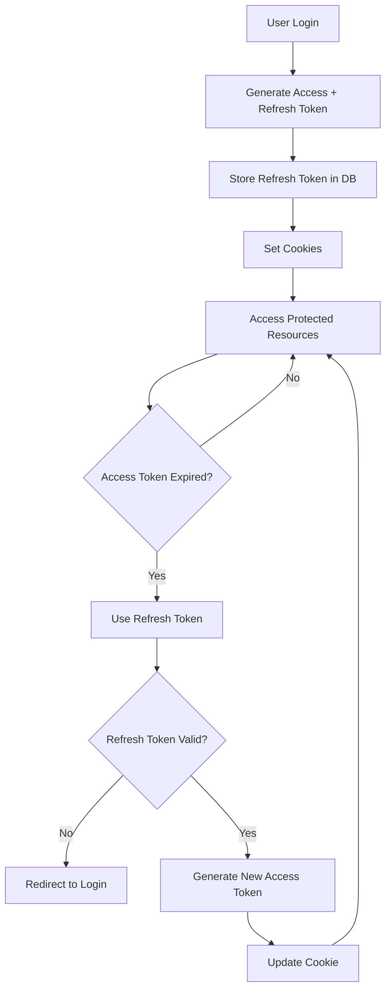

# JWT Refresh Token Implementation

## 🔒 **Overview**

This implementation provides secure session management using JWT access and refresh tokens, offering better security than traditional long-lived tokens.

## 🏗️ **Architecture**

### **Two-Token System**
- **Access Token**: Short-lived (15 minutes) for API requests
- **Refresh Token**: Long-lived (7 days) for token renewal

### **Security Features**
- Tokens stored as httpOnly cookies (XSS protection)
- Refresh tokens stored in database for revocation
- Multiple device session management
- Automatic token cleanup

## 📊 **Token Lifecycle**



## 🔧 **Implementation Details**

### **1. Token Generation**
```javascript
// New token utility functions
generateTokens(res, userId)     // Generate both tokens
generateAccessToken(userId)     // Access token only  
generateRefreshToken(userId)    // Refresh token only
verifyRefreshToken(token)       // Verify refresh token
```

### **2. User Model Enhancement**
```javascript
// New user methods
user.addRefreshToken(token)        // Store refresh token
user.removeRefreshToken(token)     // Remove specific token
user.removeAllRefreshTokens()      // Logout all devices
user.hasValidRefreshToken(token)   // Check token exists
```

### **3. Database Schema**
```javascript
refreshTokens: [{
    token: String,              // Hashed refresh token
    createdAt: {
        type: Date,
        default: Date.now,
        expires: 604800         // 7 days TTL
    }
}]
```

## 🌐 **API Endpoints**

### **Authentication Routes (`/api/auth`)**

| Endpoint | Method | Description | Auth Required |
|----------|--------|-------------|---------------|
| `/refresh` | POST | Refresh access token | Refresh Token |
| `/logout` | POST | Logout current device | Access Token |
| `/logout-all` | POST | Logout all devices | Access Token |
| `/token-info` | GET | Get token information | Access Token |

### **Enhanced User Routes**
- Registration and login now generate both tokens
- Logout properly clears both tokens
- Multiple session support

## 🔒 **Security Benefits**

### **1. Reduced Attack Surface**
- Short-lived access tokens limit exposure
- Refresh tokens can be revoked immediately
- XSS protection via httpOnly cookies

### **2. Session Management**
- Track active sessions per user
- Revoke specific device sessions
- Logout from all devices functionality

### **3. Token Rotation**
- Access tokens refreshed automatically
- Refresh tokens have limited lifespan
- Invalid tokens rejected immediately

## 📝 **Usage Examples**

### **Frontend Integration**
```javascript
// Automatic token refresh on 401 errors
axios.interceptors.response.use(
    response => response,
    async error => {
        if (error.response?.status === 401) {
            // Try to refresh token
            const refreshResponse = await axios.post('/api/auth/refresh');
            if (refreshResponse.status === 200) {
                // Retry original request
                return axios.request(error.config);
            }
        }
        return Promise.reject(error);
    }
);
```

### **Admin Session Management**
```javascript
// Get user's active sessions
const tokenInfo = await axios.get('/api/auth/token-info');
console.log(`Active sessions: ${tokenInfo.data.activeTokens}`);

// Logout from all devices
await axios.post('/api/auth/logout-all');
```

## 🧪 **Testing**

### **Automated Tests**
```bash
# Test refresh token functionality
npm run test-refresh-tokens

# Test all security improvements
npm run test-improvements
```

### **Manual Testing**
1. Login to create tokens
2. Wait for access token expiry
3. Make API request (should auto-refresh)
4. Test logout functionality
5. Verify token revocation

## ⚙️ **Configuration**

### **Environment Variables**
```env
JWT_SECRET=your_access_token_secret
JWT_REFRESH_SECRET=your_refresh_token_secret
```

### **Token Timeouts**
- Access Token: 15 minutes (configurable)
- Refresh Token: 7 days (configurable)
- Database TTL: Automatic cleanup

## 📊 **Monitoring**

### **Token Metrics**
- Active refresh tokens per user
- Token refresh frequency
- Failed refresh attempts
- Session duration analytics

### **Security Alerts**
- Multiple failed refresh attempts
- Unusual session patterns
- Token reuse attempts

## 🚀 **Production Considerations**

### **Scaling**
- Refresh tokens stored in database (not memory)
- Automatic cleanup via MongoDB TTL
- Horizontal scaling support

### **Security**
- Use strong secrets in production
- Enable HTTPS for secure cookies
- Monitor for suspicious activity
- Regular security audits

---

**Implementation Complete!** ✅

Your MERN e-commerce application now has enterprise-grade JWT refresh token security with:
- 🔒 Short-lived access tokens (15 min)
- 🔄 Long-lived refresh tokens (7 days)  
- 📱 Multiple device session management
- 🛡️ XSS protection via httpOnly cookies
- 📊 Token usage monitoring
- 🧪 Comprehensive testing suite
